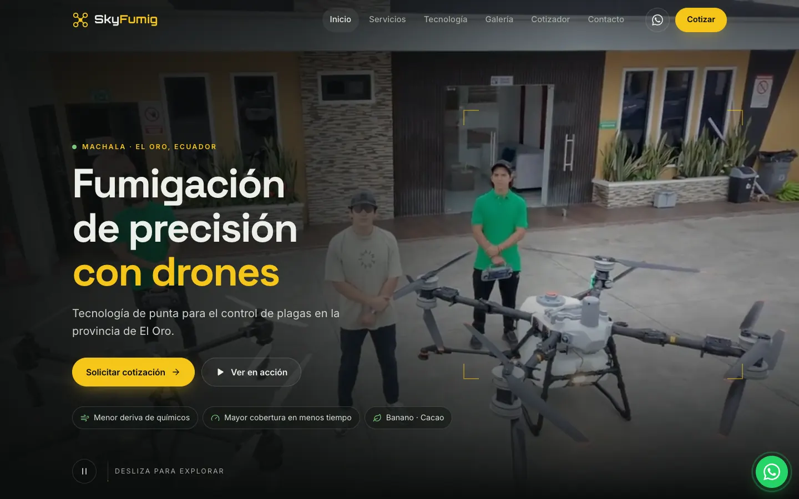
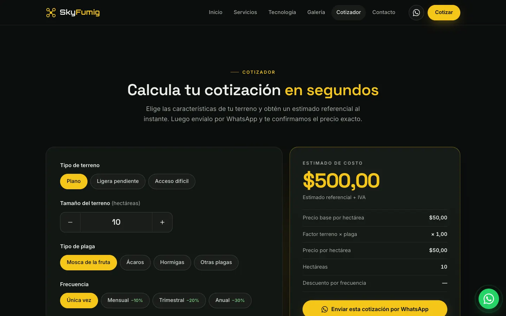

# SkyFumig: drone fumigation landing page

A landing page for **SkyFumig**, a drone crop-spraying and pest-control business in Machala, El Oro (Ecuador). It is a static site in Spanish, with no build step and no dependencies, and it is deployed on GitHub Pages.

> Sitio web de SkyFumig: fumigación agrícola con drones en Machala, El Oro.

**Live site:** https://gustavolarcodev.github.io/Fumigation/



| Quote calculator | Mobile |
| --- | --- |
|  |  |

## Features

- **Responsive "night ops" design**: a dark, gold-accented UI with fluid `clamp()` typography and a CSS Grid layout. It is tested at 360, 390, 768 and 1440 px with no horizontal scroll.
- **Video-first storytelling**: a full-bleed hero video (a landscape clip on desktop, a portrait clip on phones) and a six-clip gallery. Gallery clips stay as posters until you hover them (desktop) or scroll one into view (mobile). Clicking a clip opens an accessible `<dialog>` lightbox with controls.
- **Interactive quote calculator**: segmented radio pills, a hectare stepper with validation, and a live count-up total formatted with `Intl.NumberFormat('es-EC')`. It shows a price breakdown and has a button that sends the estimate to WhatsApp as a prefilled message.
- **Contact form without a backend**: labeled floating-label fields, inline validation and an `aria-live` status line. On submit, the form opens a WhatsApp chat or an email draft with the message already filled in.
- **Accessibility**:
  - Semantic landmarks and a skip link.
  - A single `<h1>`.
  - `:focus-visible` rings and touch targets of at least 44 px.
  - A menu toggle that updates `aria-expanded` and closes with Esc.
  - Pause controls on every autoplaying video.
  - Full support for `prefers-reduced-motion`: no autoplay and no animation.
- **SEO**: meta description, Open Graph and Twitter cards with a 1200×630 image, a canonical URL, `LocalBusiness` JSON-LD, an SVG/PNG favicon set, `robots.txt` and `sitemap.xml`.
- **Map facade**: the Google Maps embed only loads when the visitor asks for it, which keeps about 0.5 MB of third-party scripts off the page.
- **Performance budget**: first load dropped from **~40 MB to ~1.2 MB** on desktop and **~0.6 MB** on mobile. The videos were re-encoded with FFmpeg: audio stripped, 540 px portrait at 30 fps, H.264 CRF 29–33 with `+faststart`. All posters are WebP. The icons are an inline SVG sprite, which replaced the Font Awesome CDN, and the JavaScript is dependency-free at about 250 lines.

## Content note

The phone number, WhatsApp number, email and testimonials are carried over unchanged from the original version of the site. Verify them with the business before using this page for real leads. They are left out of the `LocalBusiness` structured data until they are confirmed.

## Tech

HTML5 · CSS3 (custom properties, Grid, `clamp()`, `backdrop-filter`, scroll-snap) · vanilla JavaScript (IntersectionObserver, `<dialog>`, `Intl`) · FFmpeg-optimized media · GitHub Pages

## Structure

```
.
├── index.html          # markup, inline SVG icon sprite, SEO + JSON-LD
├── css/styles.css      # design tokens, layout, components, motion
├── js/main.js          # nav, reveals, video logic, lightbox, calculator, forms
├── videos/             # optimized MP4 clips
│   └── posters/        # WebP poster frames
├── img/                # og-image, favicons
├── docs/               # README screenshots
├── favicon.svg
├── robots.txt
└── sitemap.xml
```

## Run locally

```bash
python3 -m http.server 8000
# open http://localhost:8000
```

---

Built by [Gustavo Larco](https://github.com/GustavoLarcoDev).
